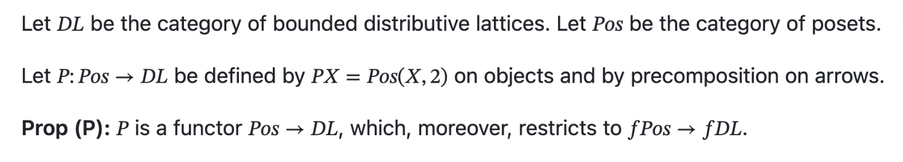

# Formalization session notes: `5_FiniteRepresentationCat.lean`

Documenting a session (Tally, Alex) playing with lean4-skills

https://github.com/cameronfreer/lean4-skills/tree/main/plugins/lean4

You can see a list of available skills at https://github.com/cameronfreer/lean4-skills/blob/main/plugins/lean4/skills/lean4/SKILL.md#commands 

We started from https://github.com/holcombet/Semiformalizing-lattices/blob/main/InformalProofs/5_FiniteRepresentation-cat.md 



and called upon the skill

	/lean4:draft 

which then produced a list of statements and definitions and proof obligations in https://github.com/holcombet/Semiformalizing-lattices/blob/main/FormalProofs/5_FiniteRepresentationCat.lean 

We then discharged all the "sorry" with the help of the skill

	/lean4:prove

On some occasions the proof got stuck (or rather in an infinite loop). Then we aborted it and used 

	/lean4:review

to get an analysis of the problem. Continuting the proof after this /lean4:prove then solved the problem each time.

---

ai generated log:

---

## Goal (what the file formalizes)

Three layers for the informal functor **P** = `Pos(-,2)`:

| Layer | Lean name | Type |
|-------|-----------|------|
| 1. Fibres | `homIntoTwo X` | `X →o Bool` with lattice + bounded order instances |
| 2. Set-level functor | `homIntoTwo_functor` | `FinPartOrdᵒᵖ ⥤ Type*` |
| 3. Lattice-valued functor | `P` | `FinPartOrdᵒᵖ ⥤ BddDistLat` |

Variance: precomposition is contravariant on homs-into-2, so the formal functor lives on **`FinPartOrdᵒᵖ`**, not on `FinPartOrd` directly.

Mathlib names used throughout: `FinPartOrd` (informal `Pos` / `fPos`), `BddDistLat` (`DL`), `FinBddDistLat` (`fDL`).

---

## lean4-skills workflow (session arc)

We did not run one long autonomous `/lean4:autoprove` pass. The session followed the skill’s **bounded single-pass + targeted prove cycles** pattern:

1. **`/lean4:draft`** — scaffold definitions (`homIntoTwo`, `P`, `homIntoTwo_functor`) with `sorry` on functor laws and lattice homomorphism fields.
2. **`/lean4:prove`** (repeated, one target at a time) — fill sorries in dependency order:
   - lattice instances on fibres
   - `P_map_precomp_boundedLatticeHom_fin`
   - `P.map_id` / `P.map_comp`
   - `homIntoTwo_functor.map_id` / `map_comp`
   - `prop_P_map_id` / `prop_P_map_comp`
3. **`/lean4:review`** — read-only checks when proofs stalled (wrong extensionality tactic, universe issues, `show` vs `change`, application parsing).

Verification ladder used throughout:

```text
lean edits → lake env lean FormalProofs/5_FiniteRepresentationCat.lean
```

(`FormalProofs.lean` only imports `Basic.lean`, so this file is checked file-by-file.)

---

## Proof order (dependency graph)

```text
homIntoTwo_lattice / distribLattice / boundedOrder / fintype
        ↓
P_map_precomp_fin
        ↓
P_map_precomp_fin_id , P_map_precomp_fin_comp   ← reusable lemmas
        ↓
P_map_precomp_boundedLatticeHom_fin
        ↓
P.map_id , P.map_comp
        ↓
homIntoTwo_functor.map_id , map_comp
        ↓
prop_P_map_id , prop_P_map_comp  (= exact of functor fields)
```

Extracting **`P_map_precomp_fin_id`** and **`P_map_precomp_fin_comp`** early paid off: the same precomposition algebra feeds `P`, `homIntoTwo_functor`, and the pointwise tails of the bounded-lattice proofs.

---

## What was proved, and how

### 1. Fibre layer (`homIntoTwo`)

| Item | Idea | Main tools |
|------|------|------------|
| `homIntoTwo_lattice` | Pointwise lattice on `OrderHom` | `inferInstanceAs (Lattice (X →o Bool))` from `Mathlib.Order.Hom.Order` |
| `homIntoTwo_distribLattice` | Distributivity | `DistribLattice.ofInfSupLe`, `ext`, `OrderHom.coe_sup/inf`, `inf_sup_left` |
| `homIntoTwo_boundedOrder` | Top/bottom | `inferInstanceAs` for `OrderTop` / `OrderBot` on `X →o Bool` |
| `monotoneOrderHomEquiv` | Monotone maps ↔ `OrderHom` | Definitional equiv |
| `homIntoTwo_fintype` | Finite fibres | `Subtype.fintype` + `Fintype.ofEquiv` |
| `P_obj` / `P_obj_fin` | Bundle as `BddDistLat` | `BddDistLat.of (homIntoTwo X)` |

### 2. Precomposition (`P_map_precomp_fin`)

Core definition: `g.comp f.hom.hom` for `f : X ⟶ Y` in `FinPartOrd`.

| Lemma | Statement | Key simp lemmas |
|-------|-----------|-----------------|
| `P_map_precomp_fin_id` | precomp by `𝟙` is identity | `FinPartOrd.hom_hom_id`, **`OrderHom.comp_id`** (not `id_comp`) |
| `P_map_precomp_fin_comp` | precomp composes | `FinPartOrd.hom_hom_comp`, `OrderHom.comp_assoc` |

**Parsing pitfall:** write `P_map_precomp_fin ψ (P_map_precomp_fin φ g)` with explicit parentheses. Lean left-associates applications, so omitting them misparses three arguments.

### 3. Bounded lattice homomorphism (`P_map_precomp_boundedLatticeHom_fin`)

Show `g ↦ g.comp f.hom.hom` preserves `⊔`, `⊓`, `⊤`, `⊥` pointwise.

| Field | Pattern |
|-------|---------|
| `map_sup'` / `map_inf'` | `ext x`, then `OrderHom.comp_coe`, `Function.comp_apply`, `OrderHom.coe_sup/inf`, `Pi.sup/inf_apply` |
| `map_top'` / `map_bot'` | `ext x`, **`change true = true`** / `change false = false`, `rfl` (use `change`, not `show`, for style linter) |

Import: `Mathlib.Order.Hom.BoundedLattice`.

### 4. Functor `P : FinPartOrdᵒᵖ ⥤ BddDistLat`

| Field | Proof skeleton |
|-------|----------------|
| `map_id` | `rw [← BddDistLat.ofHom_id]` → `congr_arg BddDistLat.ofHom` → `BoundedLatticeHom.ext` → `change` to named BLH → `exact P_map_precomp_fin_id` |
| `map_comp` | `BddDistLat.hom_ext` → `CategoryTheory.unop_comp` → `BoundedLatticeHom.ext` → `change` + `BoundedLatticeHom.comp_apply` → `exact P_map_precomp_fin_comp` |

**Review finding:** `BddDistLat.hom_ext` expects equality of `.hom` fields; do not `intro g` before it when the goal is still wrapped in `Hom.hom (ofHom …) g`. The working pattern uses `change` to name `P_map_precomp_boundedLatticeHom_fin` before pointwise close.

Opposite-category hook: `(𝟙 X).unop = 𝟙 (unop X)` via `CategoryTheory.unop_id`; `(φ ≫ ψ).unop = ψ.unop ≫ φ.unop` via `CategoryTheory.unop_comp`.

### 5. Functor `homIntoTwo_functor : FinPartOrdᵒᵖ ⥤ Type*`

Same precomposition, but morphisms are `TypeCat.ofHom` functions.

| Field | Proof skeleton |
|-------|----------------|
| `map_id` | `ConcreteCategory.hom_ext` → `OrderHom.ext` → `funext x` → `TypeCat.ofHom_apply`, `types_id_apply`, `P_map_precomp_fin_id` |
| `map_comp` | same entry → `types_comp_apply`, `P_map_precomp_fin_comp` |

**Review finding:** `Equiv.injective (TypeCat.homEquiv _ _)` fails with **universe constraints** (`homIntoTwo` in `u`, `Type*` in `u+1`). `ConcreteCategory.hom_ext` is the idiomatic fix.

### 6. Named props (`prop_P_*`)

| Theorem | Proof |
|---------|-------|
| `prop_P_map_id` | `exact P.map_id X` |
| `prop_P_map_comp` | `exact P.map_comp φ ψ` |
| `prop_P_restricts_fin` | `rfl` (definition of `P_fin_obj`) |

These are the informal **Prop (P)** functor laws, exported as theorems for the prose track.

---

## Mathlib lemmas worth remembering

| Topic | Names |
|-------|--------|
| `FinPartOrd` morphisms | `FinPartOrd.hom_hom_id`, `FinPartOrd.hom_hom_comp` |
| `OrderHom` composition | `OrderHom.comp_id`, `OrderHom.comp_assoc`, `OrderHom.comp_coe` |
| Opposite category | `CategoryTheory.unop_id`, `CategoryTheory.unop_comp` |
| `BddDistLat` | `BddDistLat.ofHom`, `BddDistLat.ofHom_id`, `BddDistLat.hom_ext`, `BddDistLat.hom_comp` |
| `BoundedLatticeHom` | `BoundedLatticeHom.ext`, `BoundedLatticeHom.id_apply`, `BoundedLatticeHom.comp_apply` |
| `Type*` | `TypeCat.ofHom_apply`, `CategoryTheory.types_id_apply`, `CategoryTheory.types_comp_apply`, `ConcreteCategory.hom_ext` |

---

## Common pitfalls (from `/lean4:review`)

1. **`show` vs `change`** — style linter rejects `show` when it rewrites the goal; use `change` for intentional rewrites (e.g. top/bot on `Bool`).
2. **Wrong `OrderHom` comp lemma** — precomposition uses `g.comp f`, so identity-on-the-right needs **`comp_id`**, not `id_comp`.
3. **Structure literals in goals** — after `BoundedLatticeHom.ext`, goals may still display `{ toFun := … } g`. Use `change (P_map_precomp_boundedLatticeHom_fin … g) = …` before `exact` helper lemmas.
4. **Contravariant composition order** — helper `P_map_precomp_fin_comp` uses morphisms `φ : B ⟶ A`, `ψ : C ⟶ B` so that `(ψ ≫ φ)` matches `(φ ≫ ψ).unop` after `unop_comp`.
5. **Universe issues with `TypeCat.homEquiv`** — prefer `ConcreteCategory.hom_ext` for `Type*` morphism equality.

---

## Current status

**Complete (no sorries)** in `5_FiniteRepresentationCat.lean`:

- All fibre instances and bundling through `P_obj_fin`
- `P_map_precomp_boundedLatticeHom_fin`
- Functors `P` and `homIntoTwo_functor` (including `map_id` / `map_comp`)
- `prop_P_map_id`, `prop_P_map_comp`, `prop_P_restricts_fin`

**Not yet in this file** (still in the informal chapter):

- Functor **S** and props (S), unit/counit **ξ**, **α**, triangle identities, representation theorem
- Link `P_fin_obj` with `P.obj` after forgetting `FinBddDistLat → BddDistLat` (TODO comment in Lean)

---

## Suggested next steps

1. Add forgetful functor lemmas connecting `P.obj` and `P_fin_obj`.
2. Begin formalizing **S** (`DL(-,2)`) mirroring the same three-layer pattern.
3. If extending further, keep extracting **pointwise precomposition lemmas** before upgrading to `BoundedLatticeHom` or functor laws — that was the most reusable part of this session.
