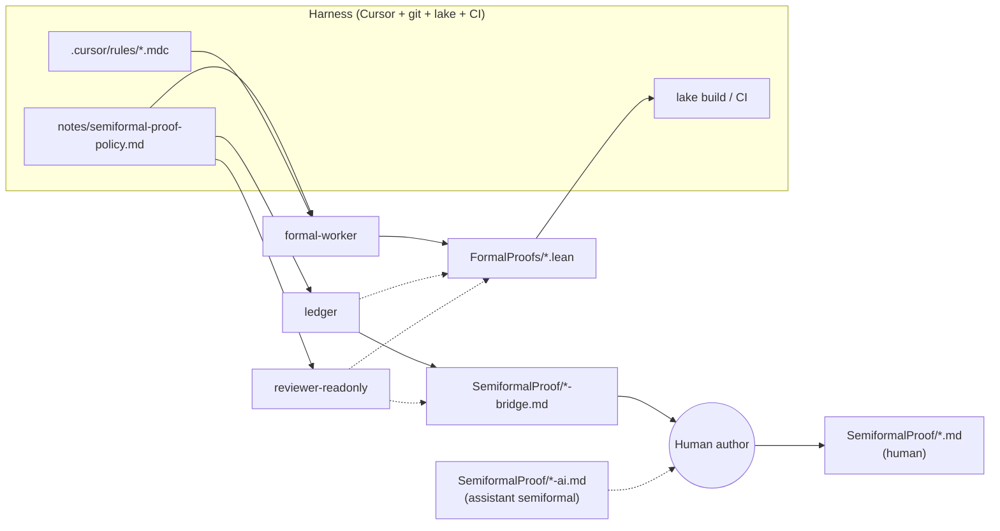

# Multi-agent specifications: a short review

This note complements `notes/semiformal-proof-policy.md`. That policy uses the word **“agents”** in the plural because **more than one automated actor** can touch a project over time (interactive assistant, background jobs, future bots). It does not presuppose a heavyweight multi-agent *framework*. This document surveys ways people specify multi-agent systems when you *do* want explicit structure. **Appendix A** maps those ideas to **Cursor-style harnesses** and to concrete roles in *Semiformalizing-lattices*.

---

## 1. What is being “specified”?

A useful spec answers some combination of:

| Dimension | Question |
|-----------|----------|
| **Roles** | Who exists (planner, coder, reviewer, “user proxy”)? |
| **Authority** | Who may write which paths, run which commands, merge PRs? |
| **Goals** | What counts as done (tests green, proof sorry-free, prose updated)? |
| **Interfaces** | What messages or artefacts are exchanged (diffs, JSON, tickets)? |
| **Termination** | When to stop, escalate to human, or split work? |
| **Safety** | What must never happen (secrets, force-push, editing human `*.md`)? |

Specifications range from **prose policy** (cheap, flexible) to **executable orchestration** (expensive, precise).

---

## 2. Prose policy and checklists (lightweight)

**Form:** Markdown rules, CONTRIBUTING sections, “allowed / forbidden” lists.

**Strengths:** Low ceremony; humans actually read it; easy to version beside code.

**Weaknesses:** Ambiguous under edge cases; no automatic enforcement unless paired with hooks or review.

**Fit:** Default for small teams and for this repository’s `semiformal-proof-policy.md` model.

---

## 3. Agent cards (persona + constraints)

**Form:** One card per role: mission, inputs, outputs, tools, invariants (“never edit X”), escalation triggers.

**Strengths:** Onboarding and prompt design become repeatable; good for **delegated sub-tasks** with different tool scopes.

**Weaknesses:** Cards drift from code unless someone updates them when behaviour changes.

**Fit:** IDE hosts that spawn “explore vs implement” style workers; optional `notes/agents/` folder if you formalise roles.

---

## 4. Capability matrices and ACLs

**Form:** Table: role × resource × {read, write, propose, execute}.

**Strengths:** Makes **consent and write friction** explicit (aligns with “human `*.md` is special”).

**Weaknesses:** Maintenance overhead; still need human process for exceptions.

**Fit:** CI bots, separate deploy keys, or when multiple automation pipelines coexist.

---

## 5. Protocols and message schemas

**Form:** Define message types (request, patch proposal, review verdict), optional JSON schema, event names.

**Strengths:** Clear **handoffs** between agents; enables logging and replay.

**Weaknesses:** Up-front design cost; overkill for a single human + one assistant.

**Fit:** Microservices-style agent buses, or research stacks with tool-calling loops.

---

## 6. State machines and lifecycle diagrams

**Form:** States (idle, drafting, reviewing, blocked-on-human), transitions, guards.

**Strengths:** Good for **rare human gates** (e.g. “proposals may only move to APPLIED after human ACK”).

**Weaknesses:** Parallel work and branching make diagrams messy.

**Fit:** Editorial workflows, release trains, formalisation pipelines with explicit review.

---

## 7. Goal graphs / task DAGs

**Form:** Decompose work into a DAG; assign nodes to roles; scheduler dispatches ready nodes.

**Strengths:** Natural for **build-like** pipelines (formalise lemma A before B).

**Weaknesses:** Brittle when discovery reshapes the graph; needs dynamic replanning.

**Fit:** Batch formalisation, CI stages, or planner-worker patterns with a replanning loop.

---

## 8. Blackboard / shared workspace pattern

**Form:** Agents read/write a shared artefact (wiki, ticket, `-bridge.md`, database).

**Strengths:** Loose coupling; easy to add a new agent that “only appends to the ledger”.

**Weaknesses:** Race conditions and edit conflicts unless conventions are strict (append-only sections, locking).

**Fit:** This repo’s **`-bridge.md` ledger** (and assistant `-ai.md` layer) is a mild blackboard: low coordination cost, human still owns merge to narrative.

---

## 9. Hierarchical supervisor–worker

**Form:** A meta-agent assigns subtasks, aggregates results, enforces policy.

**Strengths:** Central place to enforce **rarity** of human interruptions (supervisor batches proposals).

**Weaknesses:** Supervisor can become a bottleneck or single point of failure.

**Fit:** “Orchestrator” in multi-agent frameworks; in IDEs, often approximated by the human or by a single long-running session.

---

## 10. Debate / redundant verification

**Form:** Two agents propose conflicting answers; a third arbitrates or human decides.

**Strengths:** Can catch subtle errors in proofs or specs.

**Weaknesses:** High token and attention cost; diminishing returns if roles are weakly differentiated.

**Fit:** High-stakes verification; usually **not** worth it for routine lemma scaffolding.

---

## 11. Test-driven agent contracts

**Form:** Behaviour specified by **acceptance tests** (CI, `lake build`, golden output, snapshot tests on generated markdown).

**Strengths:** Ground truth is executable; agents can iterate until green.

**Weaknesses:** Tests do not specify *good* prose or pedagogy, only absence of breakage.

**Fit:** Always valuable as a **backstop** alongside human judgement for semiformal quality.

---

## 12. Industry / research stacks (names only)

Different ecosystems encode the same ideas under different labels: tool-calling agents, planner–executor, LangGraph-style graphs, “constitutions,” guardrails, policy engines. The **artifact** is usually a mix of: prompts, graphs, policies, and tests—not one magic file.

---

## 13. Choosing a level of formality

| Situation | Reasonable spec |
|-----------|-----------------|
| One human + one assistant, low risk | Prose policy + `-bridge.md` ledger + `-ai.md` layer |
| Frequent delegated runs | Agent cards + capability table |
| Many automated actors / compliance | Protocols + ACL + CI contracts |
| Research or high assurance | State machines + tests + redundant review |

---

## 14. Relation to `semiformal-proof-policy.md`

That policy intentionally stays near the **top row** of the table above: human consent, batched proposals, file-level separation (`*.md` vs `*-ai.md` vs `*-bridge.md`). If you later add more automation, **add artefacts** (cards, proposal queue file, CI checks) rather than rewriting the human narrative file on every pass.

For day-to-day work, treat “multi-agent” as often meaning **multiple scoped invocations of the same tool** (worker vs read-only reviewer), governed by one policy file and a few repo artefacts—not necessarily a separate long-running agent service.

---

## Appendix A: Roles in a Cursor-style harness (with examples from this repo)

This appendix answers: *How would you actually implement “different agents” using common AI formalisms (e.g. Cursor)?* It stays mostly in **natural language**, but ends with a **small software-style view** of behaviour, interconnection, and dependencies.

### A.1 Is “agent” versus “harness” a meaningful distinction?

**Yes, if you use the words narrowly:**

| Term | Meaning here |
|------|----------------|
| **Agent** | A **role** or **policy bundle**: a defined mission, allowed tools/paths, inputs, outputs, and invariants. In practice it is often **one chat invocation** (or one sub-task) started with a scoped prompt and constraints—not a separate daemon process. |
| **Harness** | Everything that **hosts, routes, and constrains** those invocations: the IDE, tool APIs, repository layout, `lake`, git, CI, and your **written policies** (`notes/semiformal-proof-policy.md`, optional agent cards under `notes/agents/` if you add them). |

The same underlying model can play different agents (roles) depending on prompt, allowed write paths, and read-only flags. The harness is what makes those roles repeatable and safe enough to trust.

If you collapse the distinction, you still benefit from **thinking** in two layers: *what the role does* versus *what the environment guarantees*.

### A.2 Cursor-shaped building blocks (informal map)

These are the usual levers in a Cursor-style setup; they are **not** mutually exclusive—combine a thin policy file with one or two structural constraints.

| Mechanism | What it specifies | Typical use for “another agent” |
|-----------|-------------------|----------------------------------|
| **Repo policy markdown** | Global rules, consent, file tiers | `notes/semiformal-proof-policy.md` applies to every invocation. |
| **`.cursor/rules/*.mdc`** | Path globs, `alwaysApply`, local conventions | e.g. Lean style in `Semiformalizing-lattices/.cursor/rules/lean4.mdc`—loads automatically when editing `.lean`. |
| **Skills (`SKILL.md`)** | Procedure templates the user (or agent) invokes by name | e.g. lean4-skills: explicit commands vs ad hoc proof help. |
| **AGENTS.md / pointers** | “Read this policy first” | Optional one-liner in repo root pointing authors and assistants to `notes/semiformal-proof-policy.md`. |
| **Sub-tasks / delegated runs** | Read-only vs write, exploration vs implementation | “Explore only” passes over `mathlib` or the repo; “implement” passes touch agreed paths. |
| **Hooks** | Automations on events (save, submit, etc.) | Guardrails (format, lint); easy to over-couple—use sparingly for fragile prose. |
| **MCP / external tools** | Extra capabilities (Lean LSP, bibliography) | Same **role** can call different tools; different **roles** might be allowed different MCP servers. |
| **CI (`lake build`, tests)** | Objective acceptance | Harness-level contract: merges should stay green. |

None of these *are* agents by themselves; they are **harness knobs** that you attach to **named roles** below.

### A.3 A concrete agent catalogue for *Semiformalizing-lattices*

These are **recommended roles**—natural-language job descriptions you can paste at the top of an invocation or capture once in `notes/agents/<role>.md` (optional). They are **not** separate binaries.

| Role id | Mission | May write | Must not write (unless human explicitly overrides) | Reads / depends on |
|---------|---------|-----------|------------------------------------------------------|---------------------|
| **ledger** | Maintain the bridge table (markdown ↔ Lean), lemma names, `sorry` list; batch proposals for human prose. | `SemiformalProof/<Name>-bridge.md`, optional `<Name>-proposals.md` | `SemiformalProof/<Name>.md` | `FormalProofs/*.lean`, human `.md` (read), `semiformal-proof-policy.md` |
| **informalize** | Lean → assistant semiformal in `-ai.md`. | `SemiformalProof/<Name>-ai.md`, bridge notes | Human `.md`, Lean (unless asked) | `.lean`, `-bridge.md`, human `.md` (style) |
| **formalize** | `-ai.md` → Lean statements and proofs. | `FormalProofs/*.lean`, bridge status | Human `.md`, `-ai.md` (unless asked to fix prose first) | `-ai.md`, `-bridge.md`, `lake`, lean4 rules |
| **compare** | Report alignment (S / St / Sc / …) between semiformal and Lean; read-only. | Optional `-ai.md` remark / alignment notes if asked | Human `.md`, `.lean`, proof bodies | All semiformal + Lean for scope |
| **formal-worker** | Alias for heavy **formalize** work: prove, refactor, close sorries. | Same as **formalize** | Human `SemiformalProof/<Name>.md` | Same as **formalize** |
| **reviewer-readonly** | Summarise diffs, find sorries, check policy compliance; suggest **one** batched prose change list. | Nothing (or comments in PR only) | All tracked files | Git diff, `-bridge.md`, policy |
| **explore** | Map codebase, find relevant lemmas, readonly search. | Nothing | Writes | Same as harness read access |
| **human-author** | Decide mathematics and pedagogy; merge proposals into narrative. | `SemiformalProof/<Name>.md` | (N/A—human) | Everything |

The **human** row is first-class: the harness should assume **only** the human (or explicit human delegation) performs the last step on human-facing semiformal files, per `semiformal-proof-policy.md`.

**Illustration tied to chapter 5:** `theorem_5_19_i` might cycle **formalize** (sketch in `5_FiniteRepresentation-ai.md` → Lean + `lake build`) and **informalize** (refresh `-ai.md` after the proof changes), with **ledger** maintaining `5_FiniteRepresentation-bridge.md`. A **reviewer-readonly** pass batches human-layer suggestions. None of that requires editing `SemiformalProof/5_FiniteRepresentation.md` without your consent.

### A.4 Software-style view: behaviour, interconnection, dependencies

Treat each **role** as a **component** with an interface. The **harness** is the composition layer.

**Dependencies (who needs whom):**

- Every automated role **depends on** `notes/semiformal-proof-policy.md` (normative file-tier and consent rules).
- **formal-worker** **depends on** `lake` + `mathlib` + `.cursor/rules` relevant to Lean.
- **ledger** **depends on** read access to Lean and human markdown; **optional downstream** of formal-worker (consume new lemma names).
- **reviewer-readonly** **depends on** git state and policy; **optional downstream** of formal-worker and ledger.
- **human-author** **depends on** proposals in `-bridge.md` / `-proposals.md` when choosing to edit human `.md`.

**Interconnection (data flow, simplified):**

**Behaviour contracts (one line each):**

- **formal-worker:** “If you change statements, stop and ask; otherwise close sorries and keep `lake build` green.”
- **ledger:** “Append structured deltas to `-bridge.md`; never silently rewrite human `.md`.”
- **reviewer-readonly:** “Output only: summary, policy violations, consolidated proposal list.”

That is already enough **software design** for many labs: components, interfaces, forbidden edges, and a single source of policy truth.

### A.5 Natural language versus “more formal” specs

For this repository, prefer:

1. **This appendix + `semiformal-proof-policy.md`** as the canonical prose.
2. **Optional** `notes/agents/<role>.md` agent cards if roles multiply (copy the table row into a short file per role).
3. **Escalate** to state machines or JSON protocols only if you add **unsupervised** multi-step automation (nightly bots, ticket-driven pipelines).

The harness stays **Cursor + git + policy + optional CI**; the “agents” remain **disciplined invocation patterns**, not a fleet of mystery processes.

### A.6 Agent versus harness (short recap)

- **Agent** = role + prompt + allowed writes + invariants (often one session or sub-task).
- **Harness** = host, tools, repo layout, policies, CI, and how you **spawn** those sessions.

Keeping both words helps you **design** (who does what) without pretending each role needs its own server.
